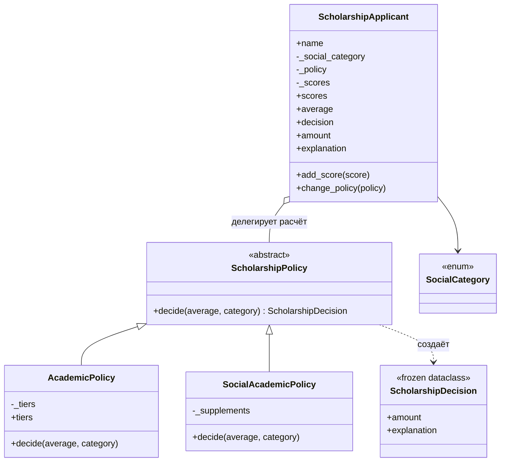

# Лабораторная работа № 5. Вариант 5 — «Стипендия»

**Дисциплина:** Парадигмы программирования (PP 2205)
**Тема:** Объектно-ориентированная парадигма: классы, объекты и инкапсуляция
**Студент:** _ФИО, группа_

## 1. Цель работы

Научиться проектировать классы Python, которые объединяют состояние и поведение, сохраняют собственные инварианты и предоставляют клиентскому коду небольшой устойчивый интерфейс.

## 2. Индивидуальный вариант

**№ 5. Стипендия.**

| Пункт | Условие |
|---|---|
| Входные данные | оценки, социальная категория, правила выплаты |
| Результат | размер стипендии и объяснение решения |
| Обязательно | классы `ScholarshipApplicant`, `ScholarshipPolicy`; свойства `average` и `amount` |
| Повышенная сложность | две взаимозаменяемые политики расчёта |

## 3. Постановка задачи

Реализовать объектную модель назначения стипендии. Претендент хранит оценки и социальную категорию, проверяет их корректность и вычисляет средний балл. Размер стипендии определяет политика расчёта, которую можно заменить без изменения кода претендента. Результат содержит сумму в тенге и текстовое объяснение.

Реализованы две политики:

- `AcademicPolicy` — ступенчатая шкала по среднему баллу (по умолчанию: ≥ 90 → 60 000, ≥ 75 → 45 000, ≥ 60 → 30 000, иначе 0 тг);
- `SocialAcademicPolicy` — базовая выплата при среднем ≥ 50, плюс надбавка по социальной категории, плюс бонус при среднем ≥ 85.

Пороги и суммы в обеих политиках условные и задаются параметрами конструктора.

## 4. Схема взаимодействия объектов



`ScholarshipApplicant` отвечает за корректность своих данных и ничего не знает о конкретных правилах выплаты. Он передаёт средний балл и категорию политике и возвращает её решение. Политика не хранит данных претендента, поэтому один объект политики можно использовать для многих претендентов.

## 5. Таблица классов

| Класс | Ответственность | Атрибуты | Методы | Инварианты |
|---|---|---|---|---|
| `ScholarshipApplicant` | данные и оценки одного претендента, делегирование расчёта | `name`, `_social_category`, `_policy`, `_scores` | `add_score`, `change_policy`, `__repr__`; свойства `scores`, `average`, `decision`, `amount`, `explanation`, `social_category` | имя не пусто; балл — число 0..100, не `bool`; категория — `SocialCategory`; политика — `ScholarshipPolicy`; `_scores` наружу только как `tuple` |
| `ScholarshipPolicy` | контракт расчёта (абстрактный) | — | `decide(average, category)` | не создаётся напрямую |
| `AcademicPolicy` | расчёт по среднему баллу | `_tiers` | `decide`; свойство `tiers` | пороги строго убывают и лежат в 0..100; суммы целые, ≥ 0 и не растут при снижении порога; шкала не пуста |
| `SocialAcademicPolicy` | базовая выплата + надбавка + бонус | `_min_average`, `_base`, `_excellence_average`, `_excellence_bonus`, `_supplements` | `decide` | суммы целые, ≥ 0; пороги в 0..100; порог бонуса ≥ порога допуска; надбавки заданы для ключей `SocialCategory` |
| `ScholarshipDecision` | неизменяемый результат расчёта | `amount`, `explanation` | — | объект неизменяем (`frozen=True`) |
| `SocialCategory` | допустимые категории | — | — | закрытый набор значений (`Enum`) |

## 6. Структура проекта

```
.
├── scholarship.py       # классы модели
├── demo.py              # демонстрационный запуск
├── test_scholarship.py  # unittest-тесты (24 теста)
├── README.md
└── .gitignore
```

## 7. Запуск

Требуется Python 3.10 или новее, сторонние библиотеки не нужны.

```bash
python demo.py                  # демонстрация
python -m unittest -v           # тесты
```

## 8. Результат демонстрационного запуска

```
== Политика: только успеваемость ==
Amina: средний 88.50; 45000 тг
  Средний балл 88.50 >= 75: академическая стипендия 45000 тг
Dias: средний 58.33; 0 тг
  Средний балл 58.33 < 60: стипендия не назначена
Mira: средний -; 0 тг
  Нет оценок: стипендия не назначена

== Политика: успеваемость + социальная надбавка ==
Amina: средний 88.50; 30000 тг
  база 20000 + бонус за успеваемость 10000 = 30000 тг
Dias: средний 58.33; 35000 тг
  база 20000 + надбавка «малообеспеченная семья» 15000 = 35000 тг
Mira: средний -; 0 тг
  Нет оценок: стипендия не назначена

== Ошибочный ввод ==
ValueError: Балл должен быть от 0 до 100; оценок осталось 4
```

Один и тот же претендент получает разные суммы при смене политики, при этом его оценки не меняются.

## 9. Результаты тестирования

`python -m unittest -v` → `Ran 24 tests ... OK`

| Группа | Что проверяется |
|---|---|
| `ApplicantTests` (9) | средний балл, `None` без оценок, неизменяемый снимок `scores`, граничные оценки 0 и 100, ошибки `ValueError` и `TypeError` с сохранением состояния, проверка конструктора, замена политики неверного типа |
| `AcademicPolicyTests` (5) | границы ступеней (59.99 / 60 / 74.9 / 75 / 89.99 / 90), отсутствие оценок, игнорирование категории, некорректные шкалы, неизменяемость `tiers` |
| `SocialAcademicPolicyTests` (6) | база, надбавка, бонус и объяснение, нет допуска при среднем < 50, включительная граница 50, некорректная конфигурация |
| `InterchangeablePoliciesTests` (4) | смена политики, собственная политика через интерфейс, абстрактный класс не создаётся, запросы не меняют состояние |

Ошибочные сценарии: `test_invalid_score_value_keeps_state`, `test_invalid_score_type_keeps_state`, `test_constructor_validation`, `test_invalid_tiers_rejected`, `test_invalid_configuration_rejected` и другие.

## 10. Скриншоты выполнения

_Вставьте скриншоты запуска `python demo.py` и `python -m unittest -v`._

## 11. Ответы на контрольные вопросы

1. **Чем класс отличается от экземпляра?** Класс описывает состояние и поведение в общем виде, экземпляр — конкретный объект с собственными значениями атрибутов. `ScholarshipApplicant` — класс, а претендент `Amina` — экземпляр.
2. **Как связаны идентичность, состояние и поведение?** Идентичность отличает один объект от другого, состояние — значения его атрибутов сейчас, поведение — методы, которыми состояние меняют или читают. Два претендента с одинаковыми оценками остаются разными объектами.
3. **Какую задачу решает `__init__`?** Создаёт корректное начальное состояние или сообщает об ошибке исключением. В проекте все проверки выполняются до записи атрибутов.
4. **Почему изменяемый список нельзя без необходимости хранить как атрибут класса?** Атрибут класса общий для всех экземпляров: оценки одного претендента попали бы к остальным. Поэтому `_scores` создаётся в `__init__` как атрибут экземпляра.
5. **Что означает `self`?** Ссылку на конкретный экземпляр, у которого вызван метод. Через неё метод получает доступ к атрибутам именно этого объекта.
6. **Чем инкапсуляция отличается от запрета доступа?** Инкапсуляция — это размещение состояния и правил его изменения в одной границе. В Python доступ технически не запрещён, `_name` лишь соглашение, а корректность обеспечивают публичные методы и свойства.
7. **Что такое инвариант и где его проверять?** Условие, истинное для каждого корректного состояния (например, 0 ≤ балл ≤ 100). Проверять нужно на границе класса: в `__init__` и в методах-командах до изменения состояния.
8. **Почему `scores` возвращает `tuple`?** Чтобы клиент не мог изменить внутренний список напрямую и обойти проверку в `add_score`.
9. **Чем команда отличается от запроса?** Команда меняет состояние (`add_score`, `change_policy`), запрос возвращает данные без видимых изменений (`average`, `amount`, `explanation`).
10. **Почему два подчёркивания не защищают секреты?** Это только изменение имени (name mangling), чтобы избежать конфликтов в наследовании. Значение по-прежнему доступно через изменённое имя, а секреты так хранить нельзя.
11. **Как распределены ответственности?** В варианте 5 `ScholarshipApplicant` отвечает за данные претендента и их корректность, `ScholarshipPolicy` и её наследники — за правила расчёта. Претендент делегирует расчёт политике.
12. **Почему тесты должны использовать публичный интерфейс?** Тест через публичный интерфейс проверяет то, на что опирается клиентский код, и не ломается при смене внутренней реализации. Обращение к `_scores` закрепило бы детали, которые должны оставаться свободными для изменения.

## 12. Вывод

Реализована объектная модель назначения стипендии. `ScholarshipApplicant` защищает собственные инварианты (корректные оценки, категория и политика) и не раскрывает внутренний список оценок. Расчёт вынесен в `ScholarshipPolicy`, поэтому две политики взаимозаменяемы без изменения кода претендента. Инварианты нельзя нарушить через публичный интерфейс, а поведение подтверждено 24 автоматическими тестами, включая граничные и ошибочные сценарии.
